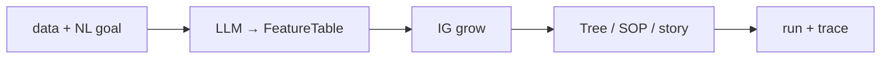

# Meta-Jev

[](https://www.python.org/downloads/)
[](#)
[](./pyproject.toml)

**一份数据 + 一句自然语言需求 → 可审计的决策树 / DecisionSOP。**  
**One data path + one natural-language goal → an auditable decision tree / DecisionSOP.**

```text
data (CSV / JSON / 文本 / 目录)  +  goal (自然语言)
                ↓  LLM normalize
          FeatureTable
                ↓  IG grow
     tree.json · sop.json · story.md
                ↓  optional trace
           可审计问答路径
```



---

## 五分钟上手 / Quickstart

```bash
cd Meta-Jev
python3 -m venv .venv && source .venv/bin/activate
pip install -e .
# 可选: pip install -r requirements.lock
cp .env.example .env   # 填 META_JEV_LLM_API_KEY（切勿提交 .env）

# 唯一产品入口：数据 + 自然语言需求
meta-jev decide \
  --data examples/data/bring_your_csv/loan_approve.csv \
  --goal "按是否批准贷款做决策树" \
  --out results/loan_decide

meta-jev decide \
  --data examples/data/batch_texts/support_emails.csv \
  --goal "把邮件分成 spam/ham 或支持类别" \
  --out results/email_decide

meta-jev decide \
  --data examples/data/homework_scoring/short_answers.csv \
  --goal "给短答打 1-5 分档并长出可审计评分 SOP" \
  --out results/hw_decide \
  --trace-examples 2

meta-jev decide \
  --data examples/data/messy_notes_sample.txt \
  --goal "分流到哪个团队" \
  --out results/messy_decide
```

别名同样可用：`meta-jev run-job` / `meta-jev from-data`。

产物目录（`--out` 或默认 `results/decide_<timestamp>/`）包含：

| 文件 | 内容 |
|------|------|
| `feature_table.json` / `.csv` | LLM 归一化后的特征表 |
| `tree.json` | IG 决策树 |
| `sop.json` | 可运行 DecisionSOP |
| `story.md` | 中英双语叙事 |
| `traces.json` | 可选示例 trace（`--trace-examples N`） |

对已有 SOP 跑一条观察：

```bash
printf '{"income_band":"high","credit_history":"good","employment_years":"5plus","debt_ratio":"low","collateral":"yes"}' \
  > /tmp/obs.json
meta-jev run --sop results/loan_decide/sop.json --input /tmp/obs.json --trace
```

数据出处见 [`examples/data/SOURCES.md`](examples/data/SOURCES.md)。

---

## 项目文档 / Docs (Feishu Wiki)

- **Wiki**: [Meta-Jev](https://hcnzpmamw7fl.feishu.cn/wiki/PeOfwAaTOik9cDkCOlWcschanEf)
- **索引**: [项目文档索引](https://hcnzpmamw7fl.feishu.cn/wiki/EmQ2wJRoqiQIcRk7nZsc5Eb7ntf)

---

## CLI

```bash
meta-jev decide --help     # 唯一公开产品入口：--data + --goal
meta-jev run --sop … --trace
meta-jev validate
meta-jev eval-afa --config configs/…
meta-jev version
```

研究向 hard-budget 曲线：

```bash
meta-jev eval-afa --config configs/eval_miniboone_hard.yaml
```

---

## 环境 / Environment

需要 **Python ≥ 3.11** 与 `.env` 中的 `META_JEV_LLM_*`（mimo 兼容 base URL / model / key）。

```bash
python3 -m venv .venv && source .venv/bin/activate
pip install -e .
pip install -r requirements.lock
cp .env.example .env   # 填 META_JEV_LLM_API_KEY — 切勿提交密钥
```

贡献方式见 [`CONTRIBUTING.md`](CONTRIBUTING.md)。更多脚本说明见 [`examples/README.md`](examples/README.md)。
