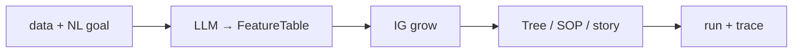

# jevtree

语言: 中文 | [English](README_EN.md)

[](https://www.python.org/downloads/)
[](#)
[](./LICENSE)

**一份数据 + 一句自然语言需求 → 可审计的决策树 / DecisionSOP。**

```text
data (CSV / JSON / 文本 / 目录)  +  goal (自然语言)
                ↓  LLM normalize
          FeatureTable
                ↓  IG grow
     tree.json · sop.json · story.md
                ↓  optional trace
           可审计问答路径
```



---

## 五分钟上手（已验证 smoke）

`jevtree decide` 需要 LLM：从 [`.env.example`](.env.example) 复制 `.env` 并填写 `JEVTREE_LLM_API_KEY`（切勿提交 `.env`）。演示 CSV 已提交在仓库内。

```bash
python3 -m venv .venv && source .venv/bin/activate
pip install -e .
cp .env.example .env   # 填 JEVTREE_LLM_API_KEY

# 推荐：一键 smoke（非 0 退出即失败）
./scripts/smoke_decide.sh

# 或手动跑同一条主路径（loan CSV）
jevtree decide \
  --data examples/data/bring_your_csv/loan_approve.csv \
  --goal "按是否批准贷款做决策树" \
  --out results/smoke_loan
```

`scripts/smoke_decide.sh` 会写入 `results/smoke_loan/`（已 gitignore），并可选对 `examples/artifacts/bring_your_csv/sample_obs.json` 跑一次 `jevtree run --trace`。

对已有 SOP 跑一条观察：

```bash
jevtree run \
  --sop results/smoke_loan/sop.json \
  --input examples/artifacts/bring_your_csv/sample_obs.json \
  --trace
```

别名同样可用：`jevtree run-job` / `jevtree from-data`。

产物目录（`--out` 或默认 `results/decide_<timestamp>/`）包含：

| 文件 | 内容 |
|------|------|
| `feature_table.json` / `.csv` | LLM 归一化后的特征表 |
| `tree.json` | IG 决策树 |
| `sop.json` | 可运行 DecisionSOP |
| `story.md` | 中英双语叙事 |
| `traces.json` | 可选示例 trace（`--trace-examples N`） |

更多演示数据（邮件 / 短答 / 杂乱文本）见 [`examples/data/`](examples/data/) 与 [`examples/data/SOURCES.md`](examples/data/SOURCES.md)。

## CLI

```bash
jevtree decide --help     # 唯一公开产品入口：--data + --goal
jevtree run --sop … --trace
jevtree validate
jevtree eval-afa --config configs/…
jevtree version
```

研究向 hard-budget 曲线：

```bash
jevtree eval-afa --config configs/eval_miniboone_hard.yaml
```

---


---

## 评测结果

**不是 SOTA 声明。** 下列数字来自仓库内 hard-budget 评测（`jevtree eval-afa`），仅对比同协议下的内置基线（`random` / `sequential`）与 IG 策略变体；**未**与 GDFS / DIME / 官方 AFABench 榜单对打。示例 CSV（loan / iris / tennis 等）不是 benchmark。完整表格、协议与可引用快照见 [`docs/RESULTS.md`](docs/RESULTS.md)。

### MiniBooNE · Acc @ budget（共享 `logistic_impute` 预测器）

| Budget | Disc (`ig_discriminative`) | IG_static | Random | Sequential |
|-------:|---------------------------:|----------:|-------:|-----------:|
| 5 | **0.824** | 0.814 | 0.746 | 0.724 |
| 10 | 0.820 | **0.822** | 0.766 | 0.728 |

<sup>来源：[`docs/snapshots/ablation_miniboone_disc_logistic_20260922T181304__comparison.json`](docs/snapshots/ablation_miniboone_disc_logistic_20260922T181304__comparison.json)（2026-09-22T18:13:04Z；由既有 `summary.json` 聚合，未重新打分）。协议：`n_train=2000`，`n_test=500`，`split_seed=0`。</sup>

### Cube without noise · Acc @ 3（协议 smoke）

| Policy | Acc@3 |
|--------|------:|
| `ig_static` | 1.000 |
| `sequential` | 1.000 |
| `random` | 0.766 |

<sup>来源：[`docs/snapshots/cube_without_noise_*_20260922T175144Z__summary.json`](docs/snapshots/)（同波次，`n_test=77`，`split_seed=0`）。</sup>

## 环境

需要 **Python ≥ 3.11** 与 `.env` 中的 `JEVTREE_LLM_*`（兼容 OpenAI 风格 base URL / model / key；亦接受遗留 `META_JEV_LLM_*`）。

```bash
python3 -m venv .venv && source .venv/bin/activate
pip install -e .
# 可选: pip install -r requirements.lock
cp .env.example .env   # 填 JEVTREE_LLM_API_KEY — 切勿提交密钥
```

更多脚本说明见 [`examples/README.md`](examples/README.md)。
