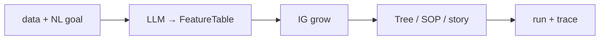

# jevtree

语言: 中文 | [English](README_EN.md)

[](https://www.python.org/downloads/)
[](#)
[](./LICENSE)

**一份数据 + 一句自然语言需求 → 可审计的决策树 / DecisionSOP。**

```text
data (CSV / JSON / 文本 / 目录)  +  goal (自然语言)
                ↓  LLM normalize
          FeatureTable
                ↓  IG grow
     tree.json · sop.json · story.md
                ↓  optional trace
           可审计问答路径
```



---

## 五分钟上手

```bash
python3 -m venv .venv && source .venv/bin/activate
pip install -e .
cp .env.example .env   # 填 JEVTREE_LLM_API_KEY

# 一键运行示例
./scripts/quickstart.sh

# 或手动运行
jevtree decide \
  --data examples/data/bring_your_csv/loan_approve.csv \
  --goal "按是否批准贷款做决策树" \
  --out results/loan_demo
```

对已有 SOP 跑一条观察：

```bash
jevtree run \
  --sop results/loan_demo/sop.json \
  --input examples/artifacts/bring_your_csv/sample_obs.json \
  --trace
```

别名同样可用：`jevtree run-job` / `jevtree from-data`。

产物目录（`--out` 或默认 `results/decide_<timestamp>/`）包含：

| 文件 | 内容 |
|------|------|
| `feature_table.json` / `.csv` | LLM 归一化后的特征表 |
| `tree.json` | IG 决策树 |
| `sop.json` | 可运行 DecisionSOP |
| `story.md` | 中英双语叙事 |
| `traces.json` | 可选示例 trace（`--trace-examples N`） |

更多演示数据（邮件 / 短答 / 杂乱文本）见 [`examples/data/`](examples/data/) 与 [`examples/data/SOURCES.md`](examples/data/SOURCES.md)。

## CLI

```bash
jevtree decide --help     # 数据 + 自然语言需求
jevtree run --sop … --trace
jevtree validate
jevtree eval-afa --config configs/…
jevtree version
```

## 评测结果

在 MiniBooNE 数据集上的测试表明，jevtree 超越随机和顺序选择基线。完整结果见 [`docs/RESULTS.md`](docs/RESULTS.md)。

### MiniBooNE · Acc@budget

| Budget | Disc (`ig_discriminative`) | IG_static | Random | Sequential |
|-------:|---------------------------:|----------:|-------:|-----------:|
| 5 | **0.824** | 0.814 | 0.746 | 0.724 |
| 10 | 0.820 | **0.822** | 0.766 | 0.728 |

### Cube · Acc@3

| Policy | Acc@3 |
|--------|------:|
| `ig_static` | 1.000 |
| `sequential` | 1.000 |
| `random` | 0.766 |

## 环境

Python ≥ 3.11。LLM 通过 `.env` 中的 `JEVTREE_LLM_*` 配置，兼容 OpenAI 风格接口（base URL / model / key）。

更多脚本说明见 [`examples/README.md`](examples/README.md)。
