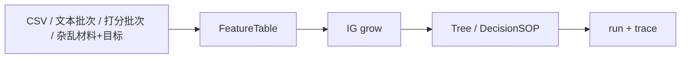

# Meta-Jev

[](https://www.python.org/downloads/)
[](#)
[](./pyproject.toml)

**把你的数据 / 材料 + 一个目标 → 长出可审计的决策树 / DecisionSOP。**  
**Bring your data or materials + a goal → grow an auditable decision tree / DecisionSOP.**

Meta-Jev 是一个**通用决策产品**（universal decision product）。贷款审批、客服分流、作业打分、工单路由等垂直故事，都是同一根脊柱上的 **preset / 示例**，不是多个独立 App。

```text
Input (any of):  table | labeled text batch | scored answers | messy corpus + goal
        ↓ normalize
   FeatureTable  (rows · feature_keys · label_key · label_kind)
        ↓ grow (information gain)
   Decision tree / SOP  (ask fewer cues → decide)
        ↓ run
   Budgeted acquisition metaphor + --trace + exportable SOP artifact
```



> 研究侧 AFABench 迭代继续走 `meta-jev eval-afa`。**演示不得宣称 Acc@budget / SOTA。**

---

## 它是什么 / What it is

| 你能带来 | 入口 | 你得到 |
|----------|------|--------|
| 干净特征表 CSV | `meta-jev grow --csv …` | 可解释决策树 + SOP + 中英 story |
| 批量文本 + 类别标签 | `meta-jev ingest-batch` | 关键词线索 → 分类 SOP |
| 作业 / 考试短答 + 分数 | `ingest-batch` + `--label-kind ordinal` | 可审计的打分线索树（不是黑盒自动阅卷 SOTA） |
| 杂乱笔记 + 一句话目标 | `meta-jev ingest-text`（需 LLM key） | 抽取表 → 同一套 grow |

**不是什么 / Not this**

- ❌ 不是 AFABench 排行榜 / Acc@budget 刷分器（那是 `eval-afa` 的事）
- ❌ 不是黑盒自动阅卷或 SOTA NLP 分类器（文本批次 v1 = 可解释关键词线索）
- ❌ 不是多个垂直 SaaS；工单路由只是可选示例

---

## 五分钟上手 / 5-minute quickstart

```bash
cd Meta-Jev
python3 -m venv .venv && source .venv/bin/activate
pip install -e .
# 依赖锁定（可选）: pip install -r requirements.lock

# A) 干净 CSV（离线，无需 LLM）
meta-jev grow --csv examples/data/bring_your_csv/loan_approve.csv \
  --label approve --out /tmp/tree.json --sop-out /tmp/tree.sop.json --seed 42
# 会打印：从你的表长出的决策树：先问 X，再问 Y，决定 approve …
printf '{"income_band":"high","credit_history":"good","employment_years":"5plus","debt_ratio":"low","collateral":"yes"}' \
  > /tmp/obs.json
meta-jev run --sop /tmp/tree.sop.json --input /tmp/obs.json --trace

# 一条命令 demo
python examples/bring_your_csv.py

# B) 批量文本分类（离线关键词线索）
meta-jev ingest-batch --csv examples/data/batch_texts/support_emails.csv \
  --label label --out-csv /tmp/email_feats.csv \
  --out /tmp/email_tree.json --sop-out /tmp/email.sop.json
# 或: python examples/batch_texts_to_tree.py

# C) 作业 / 考试短答打分（同一扇门，ordinal）
meta-jev ingest-batch --csv examples/data/homework_scoring/short_answers.csv \
  --label score --label-kind ordinal \
  --out-csv /tmp/hw_feats.csv --out /tmp/hw_tree.json --sop-out /tmp/hw.sop.json
# 叙事：可解释的打分 SOP，不是自动阅卷 SOTA

# D) 杂乱粘贴 + 一句话目标（可选 LLM；需要 .env）
# meta-jev ingest-text --goal "分流到哪个团队" \
#   --input examples/data/messy_notes_sample.txt \
#   --out-csv /tmp/messy.csv --out /tmp/messy_tree.json --sop-out /tmp/messy.sop.json
```

缺少 LLM key 时，`ingest-text` 会**明确失败**并提示改走 CSV / 文本批次 —— 不会悄悄造假行。

经典教材表示例：

```bash
meta-jev grow --csv examples/data/bring_your_csv/play_tennis.csv \
  --label play --out /tmp/tennis.json --sop-out /tmp/tennis.sop.json --seed 0
```

---

## 场景如何落到同一根脊柱 / How scenarios map

| 场景 | Ingest | `label_kind` | 示例数据 |
|------|--------|--------------|----------|
| Bring clean CSV | `grow --csv` | categorical / ordinal | `bring_your_csv/loan_approve.csv`, `play_tennis.csv`, `iris_banded.csv` |
| 文本分类批次 | `ingest-batch` | categorical | `batch_texts/support_emails.csv`, `sms_spam_excerpt.csv` |
| 作业 / 考试打分 | `ingest-batch` | ordinal | `homework_scoring/short_answers.csv` |
| 杂乱笔记 + 目标 | `ingest-text` | from LLM JSON | `messy_notes_sample.txt` |
| 工单路由（可选） | `--dataset ticket_routing` | categorical | `ticket_routing.csv` |

数据出处与许可见 [`examples/data/SOURCES.md`](examples/data/SOURCES.md)。

---

## 项目文档 / Docs (Feishu Wiki)

- **Wiki**: [Meta-Jev](https://hcnzpmamw7fl.feishu.cn/wiki/PeOfwAaTOik9cDkCOlWcschanEf)
- **索引**: [项目文档索引](https://hcnzpmamw7fl.feishu.cn/wiki/EmQ2wJRoqiQIcRk7nZsc5Eb7ntf)

---

## CLI

```bash
meta-jev grow --help          # CSV / cube / ticket_routing → tree+SOP+story
meta-jev ingest-batch --help  # texts+labels/scores → keyword FeatureTable → grow
meta-jev ingest-text --help   # messy + goal → LLM table → grow
meta-jev run --sop ... --trace
meta-jev validate --help
meta-jev eval-afa --help      # ONLY official Acc/F1-vs-budget path
meta-jev version
```

### 研究向评分（仅此路径）

```bash
meta-jev eval-afa --config configs/eval_miniboone_hard.yaml
```

`eval-afa` 是 **唯一** 产出 Acc/F1-vs-budget 的入口。示例脚本禁止冒充榜单数字。

---

## 环境 / Environment

需要 **Python ≥ 3.11**。

```bash
python3 -m venv .venv && source .venv/bin/activate
pip install -e .
pip install -r requirements.lock
cp .env.example .env   # 仅 messy 路径需要；填 META_JEV_LLM_API_KEY — 切勿提交密钥
```

---

## 诚实边界 / Honest limits

- 文本批次 v1 使用 **关键词是否出现** 作为线索（离线）——可解释，不是 embedding / SOTA NLP。
- Messy ingest 需要可用的 mimo 兼容 key；否则请用 CSV 或 text-batch。
- 长出的树是面向「少问线索、可审计 SOP」的 IG 演示，不是生产级分类器或自动阅卷器。
- 不要在 `eval-afa` 之外宣称 Acc@budget。

概念背景（仅引用，非产品宣称）：可解释规则 / 决策列表（[IML book · Decision Rules](https://christophm.github.io/interpretable-ml-book/rules.html)）、主动特征获取 / 预算式提问（[AFA survey](https://arxiv.org/abs/2502.11067)）。

---

## 可选旧演示 / Optional older demo

```bash
python examples/ticket_routing.py   # 工单预设，同一脊柱
```

更多示例说明见 [`examples/README.md`](examples/README.md)。贡献方式见 [`CONTRIBUTING.md`](CONTRIBUTING.md)。
