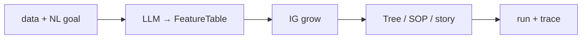

# jevtree

Language: [中文](README.md) | English

[](https://www.python.org/downloads/)
[](#)
[](./LICENSE)

**One data path + one natural-language goal → an auditable decision tree / DecisionSOP.**

```text
data (CSV / JSON / text / directory)  +  goal (natural language)
                ↓  LLM normalize
          FeatureTable
                ↓  IG grow
     tree.json · sop.json · story.md
                ↓  optional trace
           auditable Q&A path
```



---

## Five-minute quickstart

```bash
python3 -m venv .venv && source .venv/bin/activate
pip install -e .
cp .env.example .env   # set JEVTREE_LLM_API_KEY

# One-shot example
./scripts/quickstart.sh

# Or run it by hand
jevtree decide \
  --data examples/data/bring_your_csv/loan_approve.csv \
  --goal "Grow a loan-approval decision tree" \
  --out results/loan_demo
```

Run one observation against an existing SOP:

```bash
jevtree run \
  --sop results/loan_demo/sop.json \
  --input examples/artifacts/bring_your_csv/sample_obs.json \
  --trace
```

Aliases also work: `jevtree run-job` / `jevtree from-data`.

The output directory (`--out`, or default `results/decide_<timestamp>/`) contains:

| File | Contents |
|------|----------|
| `feature_table.json` / `.csv` | LLM-normalized feature table |
| `tree.json` | IG decision tree |
| `sop.json` | Runnable DecisionSOP |
| `story.md` | Bilingual narrative |
| `traces.json` | Optional example traces (`--trace-examples N`) |

More demo data (email / short answers / messy text): [`examples/data/`](examples/data/) and [`examples/data/SOURCES.md`](examples/data/SOURCES.md).

## CLI

```bash
jevtree decide --help     # data + natural-language goal
jevtree run --sop … --trace
jevtree validate
jevtree eval-afa --config configs/…
jevtree version
```

## Benchmark results

Tests on MiniBooNE show jevtree outperforms random and sequential selection baselines. Full results: [`docs/RESULTS.md`](docs/RESULTS.md).

### MiniBooNE · Acc@budget

| Budget | Disc (`ig_discriminative`) | IG_static | Random | Sequential |
|-------:|---------------------------:|----------:|-------:|-----------:|
| 5 | **0.824** | 0.814 | 0.746 | 0.724 |
| 10 | 0.820 | **0.822** | 0.766 | 0.728 |

### Cube · Acc@3

| Policy | Acc@3 |
|--------|------:|
| `ig_static` | 1.000 |
| `sequential` | 1.000 |
| `random` | 0.766 |

## Environment

Python ≥ 3.11. The LLM is configured via `JEVTREE_LLM_*` in `.env` and works with any OpenAI-compatible endpoint (base URL / model / key).

More scripts: [`examples/README_EN.md`](examples/README_EN.md).
