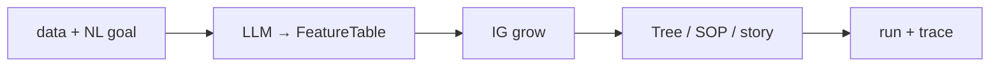

# jevtree

Language: [中文](README.md) | English

[](https://www.python.org/downloads/)
[](#)
[](./LICENSE)

**One data path + one natural-language goal → an auditable decision tree / DecisionSOP.**

```text
data (CSV / JSON / text / directory)  +  goal (natural language)
                ↓  LLM normalize
          FeatureTable
                ↓  IG grow
     tree.json · sop.json · story.md
                ↓  optional trace
           auditable Q&A path
```



---

## Five-minute quickstart (verified smoke)

`jevtree decide` needs an LLM: copy [`.env.example`](.env.example) to `.env` and set `JEVTREE_LLM_API_KEY` (never commit `.env`). Demo CSVs are already committed in-repo.

```bash
python3 -m venv .venv && source .venv/bin/activate
pip install -e .
cp .env.example .env   # set JEVTREE_LLM_API_KEY

# Recommended: one-shot smoke (non-zero exit on failure)
./scripts/smoke_decide.sh

# Or run the same primary path by hand (loan CSV)
jevtree decide \
  --data examples/data/bring_your_csv/loan_approve.csv \
  --goal "Grow a loan-approval decision tree" \
  --out results/smoke_loan
```

`scripts/smoke_decide.sh` writes to `results/smoke_loan/` (gitignored) and optionally runs `jevtree run --trace` against `examples/artifacts/bring_your_csv/sample_obs.json`.

Run one observation against an existing SOP:

```bash
jevtree run \
  --sop results/smoke_loan/sop.json \
  --input examples/artifacts/bring_your_csv/sample_obs.json \
  --trace
```

Aliases also work: `jevtree run-job` / `jevtree from-data`.

The output directory (`--out`, or default `results/decide_<timestamp>/`) contains:

| File | Contents |
|------|----------|
| `feature_table.json` / `.csv` | LLM-normalized feature table |
| `tree.json` | IG decision tree |
| `sop.json` | Runnable DecisionSOP |
| `story.md` | Bilingual narrative |
| `traces.json` | Optional example traces (`--trace-examples N`) |

More demo data (email / short answers / messy text): [`examples/data/`](examples/data/) and [`examples/data/SOURCES.md`](examples/data/SOURCES.md).

## CLI

```bash
jevtree decide --help     # sole public product entry: --data + --goal
jevtree run --sop … --trace
jevtree validate
jevtree eval-afa --config configs/…
jevtree version
```

Research hard-budget curves:

```bash
jevtree eval-afa --config configs/eval_miniboone_hard.yaml
```

---

## Environment

Requires **Python ≥ 3.11** and `JEVTREE_LLM_*` in `.env` (OpenAI-compatible base URL / model / key; legacy `META_JEV_LLM_*` still accepted).

```bash
python3 -m venv .venv && source .venv/bin/activate
pip install -e .
# optional: pip install -r requirements.lock
cp .env.example .env   # set JEVTREE_LLM_API_KEY — never commit secrets
```

More scripts: [`examples/README_EN.md`](examples/README_EN.md).
